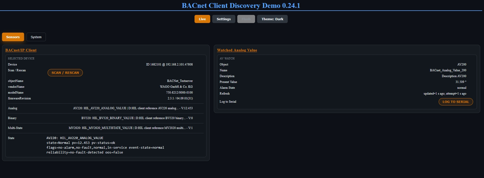

# ESP32 BACnet Stack

ESP32 BACnet Stack provides platform-neutral BACnet/IP client and read-only
server roles in C++. ESP32 Arduino/PlatformIO and native Windows applications
use the same portable core through dedicated platform adapters. The ESP32
server demo binds the portable server runtime to Arduino UDP over WiFi or
Ethernet; Windows remains a native client platform.
Native Windows CLI tools provide Who-Is/I-Am discovery and property reads.

| Target platform | Status | Integration |
| --- | --- | --- |
| ESP32 WiFi | Available | Arduino/PlatformIO |
| ESP32 Ethernet | Available | Arduino/PlatformIO |
| Windows | Available | CMake/Winsock |
| BACnet Server | Read-only demo | ESP32 WiFi/Ethernet Arduino UDP adapter |

Start with the [ESP32 WiFi and Ethernet examples](#wifi-and-ethernet-examples)
for PlatformIO projects, or use the [native Windows build and CLI tools](#native-windows-foundation)
for CMake/Winsock applications.

The project is published as open-source work in progress. APIs and protocol
coverage are still evolving.

## Current Status

The portable BACnet/IP client core is available for ESP32 WiFi, ESP32 Ethernet,
and native Windows applications. BACnet/IP server support provides a small
read-only ESP32 demo with Who-Is/I-Am and ReadProperty for its Device and
Analog Values; it is not a full BACnet server. `API` in the Windows column means the
native C++ API is available but the productive CLI does not expose that feature
directly.

| Function | ESP32 WiFi | ESP32 Ethernet | Windows |
| --- | ---: | ---: | ---: |
| Portable BACnet/IP client core | Yes | Yes | Yes |
| Discovery / I-Am | Yes | Yes | Yes |
| ReadProperty | Yes | Yes | Yes |
| Object List / Property List | Yes | Yes | Yes |
| Property cache | Yes | Yes | API |
| SubscribeCOV | Yes | Yes | CLI |
| Polling fallback | Yes | Yes | API |
| WriteProperty / Priority | Opt-in | Opt-in | Opt-in CLI |
| Rich Client Demo | Yes | Yes | No |
| Native CLI | No | No | Yes |
| BACnet Server | Read-only demo | Read-only demo | Client only |

The WiFi and Ethernet rich demos share the same BACnet application and feature
set. They differ only in network transport, board, and connection parameters.
Both enable WriteProperty and priority writes explicitly at compile time;
writes are never automatic and each UI action issues at most one request.

The Property Browser uses the remote Device `object-list` and object
`property-list` as its primary discovery paths. It loads incrementally and
shows at most eight rows to bound RAM and UI payloads; per-property failures
remain visible instead of being reported as successful fallback data. See the
[Client Guide](docs/client/README.md) for lifecycle and API details.

Repository version `0.35.0` includes the portable server runtime, Device and
Analog Value profile, and ESP32 server demo.
Package metadata and the
currently available installation version are listed in the
[PlatformIO Registry](https://registry.platformio.org/libraries/vitaly.ruhl/ESP32%20BACnet%20Stack).

## BACnet Vendor Identifier

BACnet has no private or generally free Vendor ID range. ASHRAE assigns Vendor
IDs uniquely, and the final provider of a BACnet device or software product is
responsible for configuring the appropriate value. The library does not assign
a production Vendor ID. Configure `vendorIdentifier` (currently
`BacnetServerDevice::vendorId`) and, when supported, `vendorName` for the
final product. When integrating this library into an existing product, use the
Vendor ID of that responsible product provider.

BACnet software and open-source implementors may request their own Vendor ID;
own hardware is not a prerequisite and the assignment is free. Use the
[BACnet Vendor IDs overview and assigned-ID list](https://bacnet.org/vendor-ids/)
as the primary reference and the
[ASHRAE Vendor ID assignment procedure](https://www.ashrae.org/file%20library/technical%20resources/standards%20and%20guidelines/procedures-vendor-id-rev7-5-2023.pdf)
for the official request process.

This project uses Vendor ID `555` only in clearly labelled local tests and
examples. It is ASHRAE-reserved for test/example use, is not a BACnet analogue
of a private IP range, and must not be copied into shipped or production
devices.

## Goals

- Provide one portable public `BacnetClient` role for BACnet/IP client workflows.
- Provide a portable `BacnetServer` runtime foundation without presenting it as
  a complete server implementation.
- Keep the BACnet protocol core independent from Arduino, ESP32, Windows, and
  transport-specific APIs.
- Support Arduino/PlatformIO through dedicated ESP32 adapters.
- Support native Windows applications and CLI tools through dedicated Windows
  adapters.
- Keep BACnet protocol implementation work compatible with
  `GPL-2.0-or-later WITH GCC-exception-2.0`.

## Requirements

### Portable / native core

- C++17-compatible compiler.
- No Arduino, ESP32, PlatformIO, or Windows dependency in portable modules.
- CMake for native builds and tests.

### ESP32 / Arduino

- Supported ESP32 board.
- PlatformIO with the Arduino framework.
- C++17 enabled through `-std=gnu++17`.

### Windows

- Windows with a C++17-capable MSVC toolchain.
- CMake.
- Winsock2, provided by the Windows SDK.

The BACnet protocol code is not separately implemented for Windows and ESP32.
Both platforms use the same portable core; transport, clock, logging, and
platform integration are isolated in platform adapters.

## WiFi And Ethernet Examples

The richer client demo is split deliberately:

- `examples/client-demo-wifi` preserves the existing ConfigManager-driven WiFi
  behavior.
- `examples/client-demo-ETH` targets the Wireless-Tag WT32-ETH01 V1.4
  (WT32-S1/LAN8720) and compiles ConfigManager WiFi support out.

The basic client, WAGO HIL runner, and server demo also provide an `eth`
environment alongside their existing `usb` environment. For fixed BACnet/IP
installations, wired Ethernet is generally the more stable and appropriate
transport; WiFi remains useful where cabling is unavailable.

The WT32 examples use a generic `eth` build environment and a local
`eth-com6` convenience environment. COM6 matches the current AZ-Delivery
USB-to-serial test adapter but is not a portable assumption. To flash, use
3.3 V UART levels, connect UART0 TX/RX and common ground, hold GPIO0 low while
resetting to enter the bootloader, and provide a stable supply for the ESP32
and Ethernet PHY. See the Ethernet client demo README for exact commands and
wiring.

## screenshots



## Repository Layout

| Path | Purpose |
| --- | --- |
| `src/` | Library headers and implementation |
| `examples/client-demo-wifi/` | Optional WiFi rich client demo using the shared BACnet/UI application |
| `examples/client-demo-ETH/` | Optional WT32-ETH01 V1.4 Ethernet transport variant of the same rich client demo |
| `examples/common/` | Shared example-only Ethernet and client-demo implementation helpers |
| `examples/client-object-list-scan-basic/` | Canonical serial-only basic BACnet/IP client example |
| `examples/hil-wago-client-acceptance/` | Local ESP32/WAGO client acceptance HIL runner |
| `examples/server-demo/` | Read-only ESP32 WiFi/Ethernet BACnet server demo |
| `test/` | PlatformIO Unity tests |
| `docs/` | Project documentation |

Repository setup notes are tracked in
[docs/repository-settings.md](docs/repository-settings.md).

## Minimal Use

```cpp
#include <ArduinoEspBacnet.h>
#include <WiFiUdp.h>

WiFiUDP udp;
ArduinoUdpDatagramTransport transport(udp);
ArduinoMonotonicClock clock;
BacnetClient client(transport, &clock);

void setup() {
  client.begin();
  client.sendWhoIs(BacnetIpEndpoint(255, 255, 255, 255));
}

void loop() {
  BacnetIAmDevice device;
  if (client.pollIAm(device)) {
    // Discovery result available in device.endpoint, device.deviceInstance, etc.
  }
}
```

## Documentation

Detailed documentation is split by topic:

- [Client Guide](docs/client/README.md)
- [Important Client Notes](docs/client/important.md)
- [Client API](docs/client/api.md)
- [Client Examples](docs/client/examples.md)
- [Server Guide](docs/server/README.md)
- [Planned Server Work](docs/server/planned.md)
- [Repository Settings](docs/repository-settings.md)
- [License Model](docs/license-model.md)

## Minimal Client Example

The library supports simple known-target reads through `BacnetDeviceSession`:

```cpp
#include <ArduinoBacnetClient.h>
#include <BacnetDeviceSession.h>
#include <WiFiUdp.h>

WiFiUDP udp;
ArduinoUdpDatagramTransport transport(udp);
ArduinoMonotonicClock clock;
BacnetClient client(transport, &clock);
BacnetDeviceSession device =
    BacnetDeviceSession::fromEndpoint(client, 1234,
                                      BacnetIpEndpoint(192, 0, 2, 101));

void setup() {
  client.begin();

  BacnetValue value;
  const auto status = device.readProperty(
      device.deviceObject(), BacnetPropertyId::ObjectName, value);

  if (status == BacnetDeviceSessionReadStatus::Ack) {
    Serial.println(value.displayText());
  }
}

void loop() {}
```

## Public Imports

- Client-only Arduino projects include `BacnetClient.h` and
  `ArduinoBacnetClient.h`; they do not include server declarations.
- Portable server projects include `BacnetServer.h`. ESP32 server examples use
  `ArduinoBacnetServer.h` with the existing generic Arduino UDP adapter from
  `ArduinoBacnetClient.h`; the adapter is independent of the demo profile.
- `ArduinoEspBacnet.h` is the optional combined Arduino import.
- `EspBacnet.h` remains a legacy compatibility umbrella and imports both roles;
  use one of the narrower imports in new projects.

## Build Basics

Root build:

```sh
pio run -e usb
```

Compile tests without upload:

```sh
pio test -e usb --without-uploading --without-testing
```

Portable core compile smoke test:

```sh
cmake -S tools/portable-smoke -B build/portable-smoke
cmake --build build/portable-smoke
build/portable-smoke/portable_smoke
```

The smoke target compiles the portable protocol modules without Arduino or
ESP32 headers.

## Native Windows Foundation

The native Windows build provides Winsock UDP transport, a monotonic clock,
console logging, focused localhost-only tests, and two productive CLI tools:
`bacnet-discover` and `bacnet-client`. `bacnet-discover-smoke` remains an
internal smoke/HIL target and is not an end-user program.

Requirements: CMake 3.16+, MSVC with C++17 support, and the Windows SDK.

```powershell
cmake -S tools/portable-smoke -B build/native-windows
cmake --build build/native-windows --config Debug
ctest --test-dir build/native-windows -C Debug --output-on-failure
.\build\native-windows\native\Debug\bacnet-discover-smoke.exe --help
.\build\native-windows\native\Debug\bacnet-discover-smoke.exe --self-test
```

The executables are in the MSVC multi-config output directory
`build/native-windows/native/Debug/`. `--self-test` initializes and closes the
Winsock runtime and transport only; the transport test uses local UDP loopback
on `127.0.0.1` and sends no broadcasts.

Small PowerShell examples for the productive native tools are in
[`tools/native/examples`](tools/native/examples/README.md). They cover
Who-Is/I-Am discovery, AV/BV/MSV reads, SubscribeCOV, Analog Value listing, and
an explicitly authorized Binary Value priority-8 toggle followed by a separate
relinquish step. Edit their documented `settings.ps1` test-environment values
before a parameterless invocation, or use explicit script parameters for a
one-off target.

To validate a real BACnet/IP network, configure the local interface and its
broadcast address in the examples settings or pass them at runtime:

`bacnet-discover` can also be run without network arguments. It sequentially
tries suitable active IPv4 interfaces and writes each selected bind/broadcast
pair to stderr; discovered devices remain on stdout. Use `--bind <local-ip>`
to restrict the run to one interface, and optionally provide `--broadcast`.

Build the productive Windows binaries with:

```cmd
tools\compile-windows-binaries.cmd Release
```

```powershell
.\build\native-windows\native\Debug\bacnet-discover.exe `
  --bind <local-ip> --broadcast <broadcast-ip> --timeout-ms 5000
```

`bacnet-discover` accepts an optional `--device-id <id>` filter and prints the
endpoint, best-effort Device metadata, and Object List counts. Unsupported
metadata remains visible as `<status>` and does not make discovery fail.

`bacnet-client` resolves a device by `--device-id` through `--broadcast`, or
uses `--target <ip[:port]>` directly. `--bind` is always explicit; no local
address is hard-coded. Its two subcommands are:

```powershell
.\build\native-windows\native\Debug\bacnet-client.exe `
  --bind <local-ip> --broadcast <broadcast-ip> --device-id <id> `
  list --max 20 AV0

.\build\native-windows\native\Debug\bacnet-client.exe `
  --bind <local-ip> --target <ip[:port]> --device-id <id> `
  read AV200.present-value
```

An Object selector combines a type and minimum instance (`AI0`, `AV200`,
`MSV2000`). `list` reads the Device Object List, filters and sorts existing
objects, then limits output with `--max`; it never probes an unbounded instance
range. Successful values and list rows use stdout; diagnostics and list
summaries use stderr. Property aliases include `objectName`, `presentValue`,
`statusFlags`, and `outOfService`.

Discovery returns `0` after at least one matching I-Am, `1` for runtime or
socket errors, `2` for a clean timeout, and `3` for invalid arguments. `list`
uses the same `0`-`3` convention. `read` additionally returns `4` for Reject,
`5` for Abort, and `6` for decode or unsupported-value errors.

Optional compile-time write feature gates:

`BacnetDeviceSession::writeProperty()` and the lower-level
`BacnetClient::sendWriteProperty()`/`pollWriteProperty()` encode supported
`BacnetValue` types through the shared portable application-value codec. The
write feature is disabled by default; a disabled build returns an explicit
`Disabled` status and sends no datagram. Priority-array reads and explicit
command-priority relinquish helpers are supported; direct priority-array and
automatic writes are not implemented. See
[Command Priority Reset Semantics](docs/bacnet-command-priority.md).

`BacnetWritePropertyOptions` may supply an optional priority from `1` through
`16`; omitting it preserves a normal WriteProperty request without a priority
field. Invalid priority values are rejected before sending. Priority requests
also require `ESP_BACNET_ENABLE_PRIORITY_WRITE=1`; when it is disabled, the
request returns `Disabled` before an invoke ID is reserved or a datagram is
created. The two feature gates are independently testable; enabling the
priority gate without WriteProperty is rejected at compile time.

## Property Subscriptions

`BacnetSubscribeOptions` remains source-compatible with polling subscriptions.
Set `preferCov` to request real BACnet SubscribeCOV. A successful registration
suppresses fallback polling, renews before its configured lifetime ends, and
routes matching COV notifications through the existing property cache and
callback path. Send failures, BACnet Error, Reject, Abort, and registration
timeouts are logged with the COV tag and switch the subscription to its existing
polling fallback. No hardware COV interoperability claim is made without a
separate real-device validation.

- `ESP_BACNET_ENABLE_WRITE_PROPERTY` (default `0`)
- `ESP_BACNET_ENABLE_PRIORITY_WRITE` (default `0`, requires write-property flag)

Build changed or directly affected examples when needed. See [Client Examples](docs/client/examples.md) for example roles and [docs/repository-settings.md](docs/repository-settings.md) for repository setup notes.

WT32-ETH01 V1.4 client demo build:

```sh
pio run -d examples/client-demo-ETH -e eth
```

## Dependency Maintenance

Dependabot is configured for GitHub Actions. PlatformIO platform and library dependency updates are currently manual.

<!-- markdownlint-disable MD033 -->

<br>
<br>

## Donate

<table align="center" width="100%" border="0" bgcolor:=#3f3f3f>
<tr align="center">
<td align="center">
if you prefer a one-time donation

[](https://paypal.me/FamilieRuhl)

</td>

<td align="center">
Become a patron, by simply clicking on this button (**very appreciated!**):

[](https://www.patreon.com/join/6555448/checkout?ru=undefined)

</td>
</tr>
</table>

<br>
<br>

<!-- markdownlint-enable MD033 -->

## License

This project is licensed under `GPL-2.0-or-later WITH GCC-exception-2.0`.
See [LICENSE](LICENSE), [THIRD_PARTY_NOTICES.md](THIRD_PARTY_NOTICES.md), and
[docs/license-model.md](docs/license-model.md).

Copyright 2026 Vitaly Ruhl.
