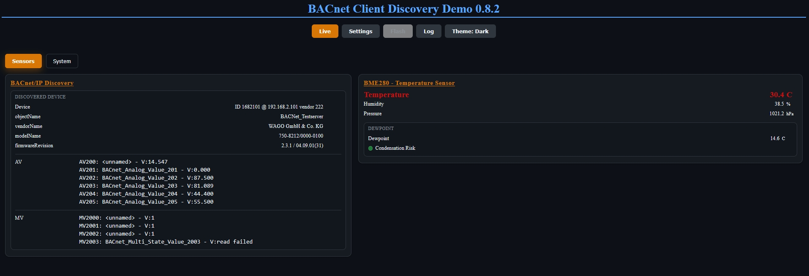

# ESP32 BACnet Stack

ESP32 BACnet Stack is an early-stage Arduino/PlatformIO library for BACnet/IP
client and server experiments on ESP32 boards.

The project is published as open-source work in progress. APIs and protocol
coverage are still evolving.

## Current Status

- Minimal `BacnetClient` discovery support is available for BACnet/IP.
- `BacnetClient` can build and send Who-Is requests and parse basic I-Am
  responses.
- Minimal client-side ReadProperty support is available for device strings,
  object lists, and selected value object `presentValue` reads.
- `BacnetDeviceSession` can represent one known remote BACnet/IP device and
  issue device-scoped ReadProperty calls through a `BacnetClient`.
- A reusable BACnet logging layer is available with application-owned outputs.
- Minimal `BacnetServer` role placeholder is available.
- BACnet/IP is the first target.
- WriteProperty is not implemented yet.
- BACnet MS/TP is planned for later work.
- No upstream `bacnet-stack` source files are imported yet.
- ESP32 Configuration Manager is not a core dependency. It may be used later
  only in explicitly optional demo examples.

## Goals

- Provide one public `BacnetClient` role for BACnet/IP client workflows.
- Provide one public `BacnetServer` role for BACnet/IP server workflows.
- Keep the core library usable from Arduino and PlatformIO projects.
- Keep BACnet protocol implementation work compatible with
  `GPL-2.0-or-later WITH GCC-exception-2.0`.

## Requirements

- ESP32 board supported by PlatformIO.
- PlatformIO with the Arduino framework.
- C++17 enabled through `-std=gnu++17`.

## screenshots




## Repository Layout

| Path | Purpose |
| --- | --- |
| `src/` | Library headers and implementation |
| `examples/client-demo/` | Minimal BACnet client role demo |
| `examples/server-demo/` | Minimal BACnet server role demo |
| `test/` | PlatformIO Unity tests |
| `docs/` | Project documentation |

Repository setup notes are tracked in
[docs/repository-settings.md](docs/repository-settings.md).

## Minimal Use

```cpp
#include <EspBacnet.h>

BacnetClient client;
BacnetServer server;

void setup() {
  client.begin();
  client.sendWhoIs();
  server.begin(1234);
}

void loop() {
  BacnetIAmDevice device;
  if (client.pollIAm(device)) {
    // Discovery result available in device.address, device.deviceInstance, etc.
  }
}
```

## BACnet/IP Client Discovery

The first client slice supports discovery:

- builds standard BACnet/IP Who-Is requests
- sends Who-Is on UDP port `47808`
- parses minimal I-Am responses into `BacnetIAmDevice`
- exposes source address, discovered device instance, max APDU, segmentation,
  and vendor ID

The `examples/client-demo` firmware demonstrates discovery on ESP32. It uses
the optional ConfigurationManager-based example setup to connect WiFi, then
sends Who-Is to the local BACnet/IP broadcast address every 30 seconds and logs
received I-Am responses.

Hardware validation for this slice was performed against a WAGO BACnet/IP
server at `<BACNET_DEVICE_IP>:47808`; the ESP32 repeatedly discovered device
instance `<DEVICE_INSTANCE>`.

The exported WAGO BACnet/IP test server configuration and programmed reference
objects are documented in `dev-info/Wago_TestServer/`.

## BACnet/IP Client ReadProperty

The client ReadProperty layer is still intentionally compact, but now uses a
generic property-access model:

- builds minimal confirmed ReadProperty requests
- accepts object type, object instance, property identifier, and optional array
  index through `BacnetPropertyRequest`
- sends ReadProperty to a BACnet/IP device
- parses confirmed ReadProperty ACKs into typed `BacnetValue` results with
  display text conversion for demos and logs
- includes public object, property, request, and value helper types small
  enough to reuse later from server-side work

The initial property targets are device `objectName`, `vendorName`,
`modelName`, and `firmwareRevision`. Hardware validation read those properties
from a WAGO device instance `<DEVICE_INSTANCE>`.

Known remote devices can also be represented with `BacnetDeviceSession`. The
session stores the device instance, address, and BACnet/IP port while
`BacnetClient` remains the transport owner.

For simple reads, `BacnetDeviceSession::readProperty()` provides a blocking
helper around the existing ReadProperty send/poll flow:

```cpp
BacnetDeviceSession device(client, discovered.deviceInstance,
                           discovered.address);

BacnetValue value;
const auto status = device.readProperty(
    device.deviceObject(), BacnetPropertyId::ObjectName, value);

if (status == BacnetDeviceSessionReadStatus::Ack) {
  Serial.println(value.displayText());
}
```

The non-blocking `examples/client-demo` firmware keeps its own request state
machine for UI-friendly scanning.

`BacnetRemoteObject` and `BacnetProperty` provide a lightweight synchronous
wrapper over the same session read path:

```cpp
auto mv2000 = device.object(BacnetObjectType::MultiStateValue, 2000);

BacnetValue value;
const auto status = mv2000.readPresentValue(value);

if (status == BacnetDeviceSessionReadStatus::Ack) {
  Serial.println(value.displayText());
}
```

The wrappers do not add scan, cache, queue, scheduler, or subscription state.

The `examples/client-demo` firmware also includes a lightweight BACnet/IP
Discovery card for demo visibility. It shows only the first discovered device,
keeps the BME280 status card unchanged, and uses the Device Object
`object-list` property as the primary path for AV/MV discovery. Up to 10 found
Analog Value objects and up to 10 found Multi-State Value objects are displayed
with `description` or `objectName` plus `presentValue` status/value.
WiFi-friendly discovery, object-list, ReadProperty, and inter-request timing
values are configurable near the top of `examples/client-demo/src/main.cpp`.
AV200/MV2000 range probing remains a disabled debug fallback, not the normal
discovery strategy. BACnet scan activity is written through the BACnet logger
and forwarded to the ConfigurationManager GUI log by the demo adapter.

## BACnet Logging

The library exposes a small structured logging layer:

- `BacnetLogLevel`
- `BacnetLogRecord`
- `BacnetLogOutput`
- `BacnetLogger`
- `BacnetScopedLogTag`

Applications attach zero, one, or multiple outputs to
`BacnetClient::logger()`. The core library does not depend on Serial,
ConfigurationManager, MQTT, or file output. Outputs can define their own level,
filter, timestamp mode, and rate limit.

`BacnetLogRecord::message` and `BacnetLogRecord::tag` pointers are valid only
during the `BacnetLogOutput::log()` callback. Buffered outputs must copy those
fields if they keep records for later `tick()` processing.

Logging callsites are controlled by `BACNET_ENABLE_LOGGING`. Debug and trace
style verbose logs are additionally controlled by
`BACNET_ENABLE_VERBOSE_LOGGING`.

## Example Local Configuration

The client demo can read local WiFi and BACnet validation values from an ignored
local secrets file:

```sh
cp examples/client-demo/src/secret/secrets.example.h examples/client-demo/src/secret/secrets.h
```

Edit `examples/client-demo/src/secret/secrets.h` for local WiFi, optional
static IP, optional MAC-priority, and BACnet target values. The `secrets.h` file
is intentionally ignored by Git and must not be committed.

## Build

Root build:

```sh
pio run -e usb
```

Tests:

```sh
pio test -e usb --without-uploading --without-testing
```

Examples:

```sh
pio run -d examples/client-demo -e usb
pio run -d examples/server-demo -e usb
```

Upload and serial monitor commands are intentionally not part of the default
validation flow because they interact with local hardware.

## Dependency Maintenance

Dependabot is configured for GitHub Actions. GitHub's official Dependabot
ecosystem list does not include PlatformIO as a package ecosystem, so PlatformIO
platform and library dependency updates are currently manual.

## License

This project is licensed under `GPL-2.0-or-later WITH GCC-exception-2.0`.
See [LICENSE](LICENSE), [THIRD_PARTY_NOTICES.md](THIRD_PARTY_NOTICES.md), and
[docs/license-model.md](docs/license-model.md).

Copyright 2026 Vitaly Ruhl.
