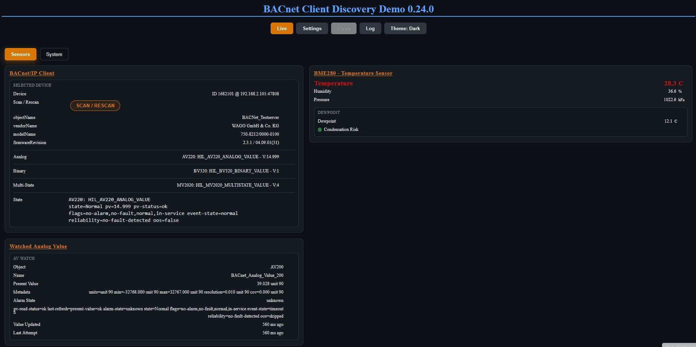

# ESP32 BACnet Stack

ESP32 BACnet Stack is an early-stage Arduino/PlatformIO library for BACnet/IP
client and server experiments on ESP32 boards.

The project is published as open-source work in progress. APIs and protocol
coverage are still evolving.

## Current Status

BACnet/IP client APIs are already usable for common read-oriented use cases,
including common process object present-value reads, cached-property access,
read-only process-object helpers, and Analog Value metadata reads, while
advanced discovery, write flows, and server MVP remain future work.

## Implementation Matrix

| Area | Capability | Status | Notes |
| --- | --- | --- | --- |
| Client discovery | Who-Is / I-Am discovery | ✅ Implemented | Core discovery flow available through `BacnetClient`. |
| Client discovery | Known-device session with `BacnetDeviceSession` | ✅ Implemented | Session keeps target identity, drives device-scoped calls, and can be created from a known endpoint or discovered `I-Am` metadata. |
| ReadProperty / values | Generic ReadProperty model | ✅ Implemented | Object + property + optional array index request model is available. |
| ReadProperty / values | Reading known device/object properties | ✅ Implemented | Works for selected known properties and known object IDs. |
| ReadProperty / values | Client-side property cache access | ✅ Implemented | Cached value/status/last-update access is available through `BacnetDeviceSession`, `BacnetProperty`, and `BacnetRemoteObject` helpers. |
| ReadProperty / values | Reading selected `present-value` from known AI/AO/AV, BI/BO/BV, and MI/MO/MV objects | 🟢 Use-case ready | Suitable for practical value monitoring on known process objects. |
| ReadProperty / values | Read-only process-object convenience helpers for known AI/AO/AV, BI/BO/BV, and MI/MO/MV objects | 🟢 Use-case ready | `BacnetProcessObject` exposes typed convenience access to `present-value`, status snapshots, and cached helper reads for common process objects. |
| ReadProperty / values | Read-only Analog Value metadata helpers | ✅ Implemented | Engineering units, min/max present-value, resolution, and COV increment reads are available for practical Analog Value monitoring flows. |
| ReadProperty / values | Reading object health/status from `status-flags`, `event-state`, `reliability`, and `out-of-service` | 🟢 Use-case ready | `BacnetDeviceSession::readObjectStatus()` reads each property safely and preserves per-property status. |
| ReadProperty / values | Derived Normal/Warning/Error/OutOfService/Unknown state | 🟡 Partial | Conservative derivation is implemented; warning/error hardware cases still need targeted HIL validation. |
| ReadProperty / values | Displaying/forwarding selected BACnet values by fallback polling | 🟢 Use-case ready | Property subscription abstraction with fallback polling is available. |
| ReadProperty / values | Typed value decode coverage | 🟡 Partial | Common value paths are supported; full coverage is still expanding. |
| Object discovery | Device `object-list` scan | ✅ Implemented | Scans entries from the remote Device object's `object-list`. |
| Object discovery | Blocking `scanObjectList()` | ✅ Implemented | Source-compatible convenience path remains available. |
| Object discovery | Non-blocking object-list scan job | ✅ Implemented | Loop-driven scan job is available for responsive applications. |
| Object discovery | Optional `object-name`, `description`, `present-value` reads during object-list scan | ✅ Implemented | Optional reads are supported during object-list scan flow. |
| Object discovery | BACnet `property-list` discovery / safe read-all | ✅ Implemented | Caller-buffered APIs discover advertised properties where available and safely attempt each property with per-property status results. |
| Subscriptions | Property subscription abstraction with fallback polling | 🟢 Use-case ready | Practical for cyclic update use cases without SubscribeCOV. |
| Subscriptions | Real SubscribeCOV | ⏳ Planned | Not implemented yet. |
| Writes | WriteProperty | 🚫 Not implemented | No write API shipped in current client runtime. |
| Writes | PresentValue priority write helpers | ⏳ Planned | Future client capability, not currently implemented. |
| Writes | Hardware writes | 🚫 Not implemented | Disabled by default; future explicit opt-in only. |
| Examples / validation | `examples/client-object-list-scan-basic` | ✅ Implemented | Canonical serial-only basic client example for known-target property read, object-list scan, and fallback polling. |
| Examples / validation | `examples/client-demo` | ✅ Implemented | End-to-end client demo with discovery, scan, process-value updates, a read-only value/status browser view, and a watched Analog Value card. |
| Examples / validation | `examples/hil-wago-client-acceptance` | 🧪 Local HIL validated | Local hardware acceptance runner for client scenarios. |
| Examples / validation | HIL scenario S01 non-blocking object-list scan | 🧪 Local HIL validated | Validated on local ESP32/BACnet-IP target setup. |
| Examples / validation | HIL scenario S02 common process present-value reads | 🧪 Local HIL validated | Validated on local ESP32/WAGO BACnet-IP target setup. |
| Examples / validation | HIL scenario S03 common process object status reads | 🧪 Local HIL validated | Validated on local ESP32/WAGO BACnet-IP target setup. |
| Examples / validation | Future HIL scenarios S04-S09 | ⏳ Planned | Present as scenario blocks and skipped by default unless enabled. |
| Server / transports | BACnet/IP server role | 🧱 Placeholder | Placeholder role exists; not a completed server feature set. |
| Server / transports | Server MVP | ⏳ Planned | Planned after client runtime completion milestones. |
| Server / transports | BACnet MS/TP | ⏳ Planned | Scheduled for later transport work. |
| Server / transports | Imported upstream bacnet-stack files | 🚫 Not implemented | Upstream files are not imported in this repository. |

Terminology:

- object-list scan means scanning entries from the remote Device object's `object-list`.
- optional reads during object-list scan means selected reads such as `object-name`, `description`, and `present-value`.
- property-list discovery/read-all means discovering advertised properties of an object where available and safely reading them with one status per property.
- property cache access means using the latest stored value/status/update timestamps from earlier reads or fallback-polled subscriptions.
- for simple use cases that need a few known variables and `present-value` display/forwarding, the current client API is already usable.

Additional status notes:

- A reusable BACnet logging layer is available with application-owned outputs.
- BACnet/IP is the first target.
- ESP32 Configuration Manager is not a core dependency. It is used only by explicitly optional demo examples.

## Goals

- Provide one public `BacnetClient` role for BACnet/IP client workflows.
- Provide one public `BacnetServer` role for BACnet/IP server workflows.
- Keep the core library usable from Arduino and PlatformIO projects.
- Keep BACnet protocol implementation work compatible with
  `GPL-2.0-or-later WITH GCC-exception-2.0`.

## Requirements

- ESP32 board supported by PlatformIO.
- PlatformIO with the Arduino framework.
- C++17 enabled through `-std=gnu++17`.

## screenshots



## Repository Layout

| Path | Purpose |
| --- | --- |
| `src/` | Library headers and implementation |
| `examples/client-demo/` | Optional GUI client demo with discovery, scan, and fallback-polled value updates |
| `examples/client-object-list-scan-basic/` | Canonical serial-only basic BACnet/IP client example |
| `examples/hil-wago-client-acceptance/` | Local ESP32/WAGO client acceptance HIL runner |
| `examples/server-demo/` | Minimal BACnet server role demo |
| `test/` | PlatformIO Unity tests |
| `docs/` | Project documentation |

Repository setup notes are tracked in
[docs/repository-settings.md](docs/repository-settings.md).

## Minimal Use

```cpp
#include <EspBacnet.h>

BacnetClient client;
BacnetServer server;

void setup() {
  client.begin();
  client.sendWhoIs();
  server.begin(1234);
}

void loop() {
  BacnetIAmDevice device;
  if (client.pollIAm(device)) {
    // Discovery result available in device.address, device.deviceInstance, etc.
  }
}
```

## Documentation

Detailed documentation is split by topic:

- [Client Guide](docs/client/README.md)
- [Important Client Notes](docs/client/important.md)
- [Client API](docs/client/api.md)
- [Client Examples](docs/client/examples.md)
- [Server Guide](docs/server/README.md)
- [Planned Server Work](docs/server/planned.md)
- [Repository Settings](docs/repository-settings.md)
- [License Model](docs/license-model.md)

## Minimal Client Example

The library supports simple known-target reads through `BacnetDeviceSession`:

```cpp
#include <EspBacnet.h>

BacnetClient client;
BacnetDeviceSession device =
    BacnetDeviceSession::fromEndpoint(client, 1234,
                                      IPAddress(192, 0, 2, 101));

void setup() {
  client.begin();

  BacnetValue value;
  const auto status = device.readProperty(
      device.deviceObject(), BacnetPropertyId::ObjectName, value);

  if (status == BacnetDeviceSessionReadStatus::Ack) {
    Serial.println(value.displayText());
  }
}

void loop() {}
```

## Build Basics

Root build:

```sh
pio run -e usb
```

Compile tests without upload:

```sh
pio test -e usb --without-uploading --without-testing
```

Optional compile-time write feature gates:

- `ESP_BACNET_ENABLE_WRITE_PROPERTY` (default `0`)
- `ESP_BACNET_ENABLE_PRIORITY_WRITE` (default `0`, requires write-property flag)

Build changed or directly affected examples when needed. See [Client Examples](docs/client/examples.md) for example roles and [docs/repository-settings.md](docs/repository-settings.md) for repository setup notes.

## Dependency Maintenance

Dependabot is configured for GitHub Actions. PlatformIO platform and library dependency updates are currently manual.

<!-- markdownlint-disable MD033 -->

<br>
<br>

## Donate

<table align="center" width="100%" border="0" bgcolor:=#3f3f3f>
<tr align="center">
<td align="center">
if you prefer a one-time donation

[](https://paypal.me/FamilieRuhl)

</td>

<td align="center">
Become a patron, by simply clicking on this button (**very appreciated!**):

[](https://www.patreon.com/join/6555448/checkout?ru=undefined)

</td>
</tr>
</table>

<br>
<br>

<!-- markdownlint-enable MD033 -->

## License

This project is licensed under `GPL-2.0-or-later WITH GCC-exception-2.0`.
See [LICENSE](LICENSE), [THIRD_PARTY_NOTICES.md](THIRD_PARTY_NOTICES.md), and
[docs/license-model.md](docs/license-model.md).

Copyright 2026 Vitaly Ruhl.
